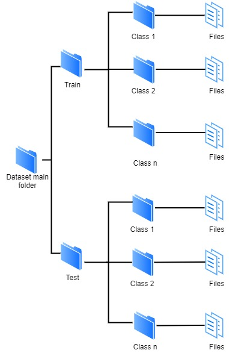

# TensorArk

TensorArk is a web application developed with Python and TensorFlow, that allows users to execute Machine Learning tasks 
through the use of a Graphical User Interface. TensorArk uses deep neural networks to achieve the execution of ML tasks. 
Currently, the application contains two modules, Image Classification and Text Classification. 
The two modules provide the following services:

- Upload image or text datasets in zip format. It is important that the uploaded datasets contain the following structure:
  
- Design the structure of neural networks
- Train and test a neural network
- See the percentage of accuracy and graphics related to the training and testing process
- Export the trained model
- Import a model to test it with new data

## Installing process

To use TensorArk you must follow the following steps:

- Clone the project
- Verify that Python 3 is installed, if not, then install it using the official [Python website](https://www.python.org/downloads/)  
- Create a virtual environment using the following command: 
  `python3 -m venv /path/to/new/virtual/environment` 
- Activate the virtual environment:  
  **Windows:** `cd /path/to/virtual/environment/Scripts/` and then  
                `activate` 
  **Linux and macOS:** `source env/bin/activate`
- After activating the virtual environment, go to the project folder and install all the project
  dependencies using the requirements.txt file: 
  `pip install -r requirements.txt`
- Once the requirements have been installed, run the project:
  `python manage.py runserver`
- Go to the localhost URL that is shown in the terminal and start using the TensorArk  
  